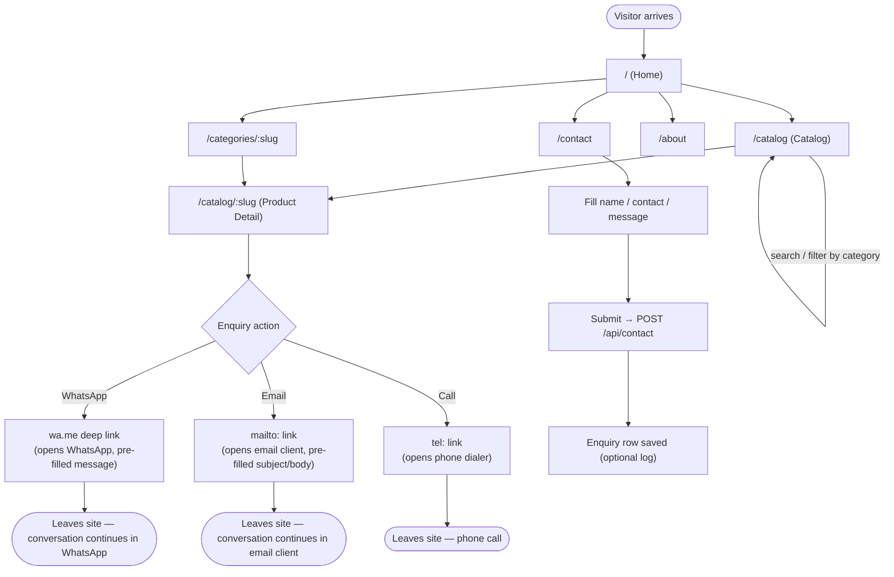
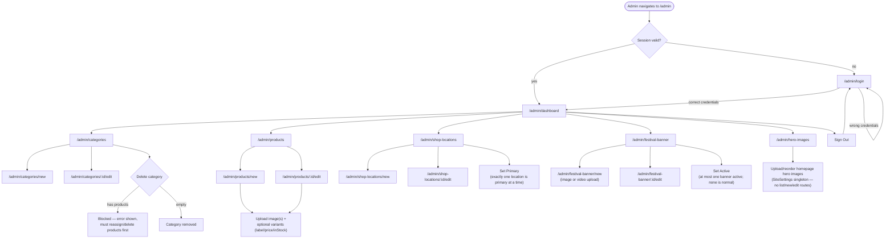
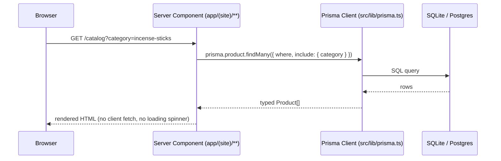
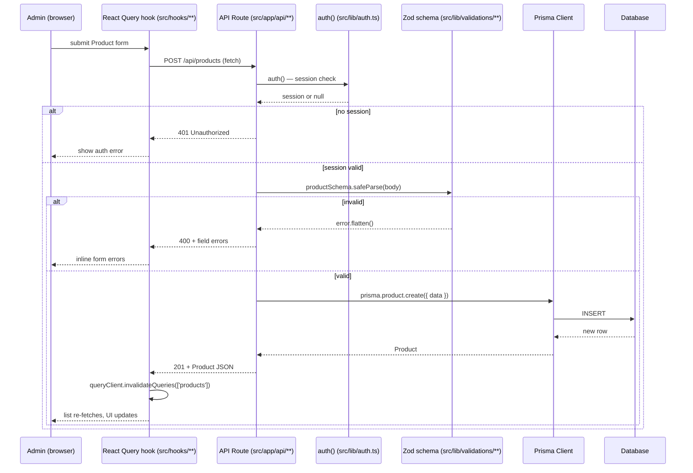
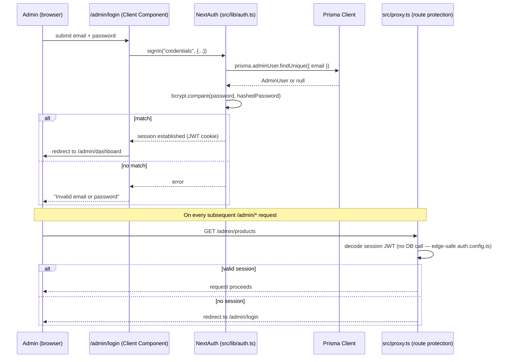
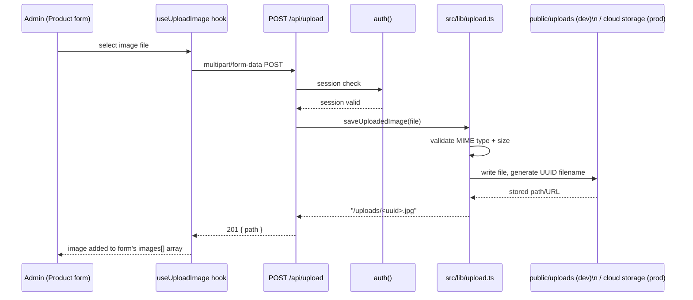
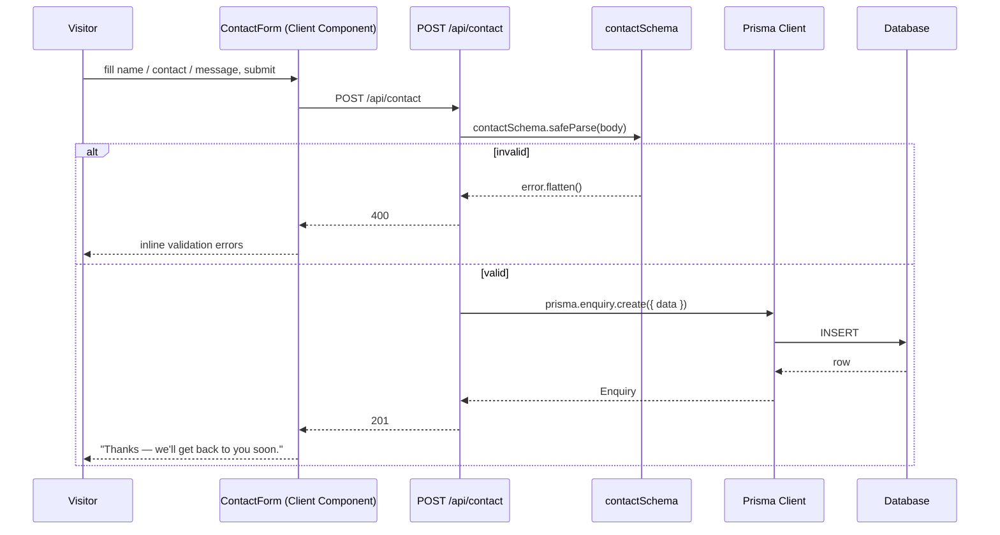

# User Flows & Data Flow

Companion to `CLAUDE.md` and `.claude/context/architecture.md` — those describe the codebase
structure and conventions; this describes how people actually move through the app and how data
moves through the system. See [README.md](../README.md) for setup.

## User Types

| User | Access | Entry point |
|---|---|---|
| Visitor | Public, no login | Any `(site)` route |
| Admin | Single role, credential login required | `/admin/*` |

There is no customer account tier — visitors never authenticate, they only browse and enquire.

---

## 1. Visitor User Flow

Key point: WhatsApp/Email/Call are **exit points** — the site never tracks what happens after the
tap. The only enquiry Chaitanya Stores can see server-side is a contact-form submission
(logged to `Enquiry`, if that optional feature is enabled).

---

## 2. Admin User Flow

Every `/admin/*` route except `/admin/login` is gated — a direct link to a protected page while
signed out redirects straight to login (see the auth data flow below).

---

## 3. Data Flow — Public Site (Server Component)

The public site never round-trips through an API route; it reads the database directly during
server rendering.

No React Query, no client-side fetch — this is the whole reason the public site loads fast and
stays simple.

---

## 4. Data Flow — Admin CRUD (React Query)

Admin screens are Client Components; server data always goes through a React Query hook →
API route → Prisma, never direct Prisma access from the browser bundle.

This same shape (hook → route → `auth()` → Zod → Prisma) applies to categories, shop locations,
and festival banners, and to delete/update, with a couple of domain-specific guards: the
category-delete route checks `product.count()` before allowing deletion ("cannot delete category
with products"), and the shop-location/festival-banner "Set Primary"/"Set Active" actions run as a
transaction that flips the previous primary/active row off before flipping the new one on, so
exactly one (or, for banners, at most one) stays true. The hero-images save (`/admin/hero-images`)
follows the same hook → route → Zod → Prisma shape but updates the single `SiteSettings` row
instead of a list.

---

## 5. Data Flow — Authentication

`auth.config.ts` (no Prisma/bcrypt imports) is what `proxy.ts` uses so the route-protection layer
never needs a database round trip — it only checks the signed JWT. The full `auth.ts` (with the
Prisma-backed Credentials provider) is only loaded by the actual sign-in API route.

---

## 6. Data Flow — Image Upload

`saveUploadedImage()` is the single seam for the local-disk → S3/Cloudinary swap described in
[README.md](../README.md#2-move-image-uploads-off-local-disk) — nothing upstream of it changes.

---

## 7. Data Flow — Enquiry (Contact Form)

Unlike WhatsApp/Email/Call, this is the one enquiry channel the business can see inside the app
(admin has no UI for it yet — the `Enquiry` table exists per the spec as an optional log; querying
it today means `npx prisma studio` or a future `/admin/enquiries` screen).
